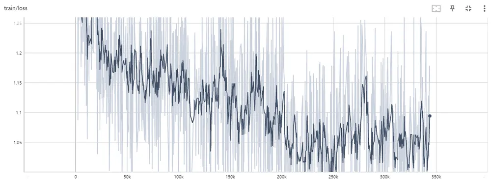
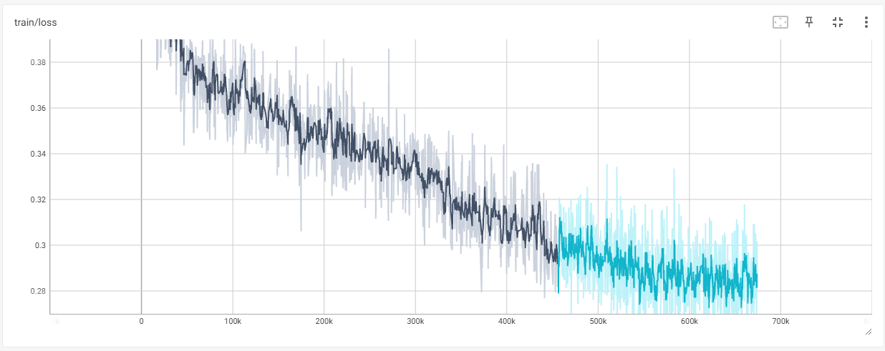

<p align="center" width="100%">

</p>

## Update Logs
- 2023.10.28: [Llama-2-ko](https://huggingface.co/beomi/llama-2-ko-7b)를 기반으로 학습된 [🤗Gugugo-koen-7B-V1.1](https://huggingface.co/squarelike/Gugugo-koen-7B-V1.1)를 공개합니다.
- 2023.09.01: 한국어-일본어 번역 모델인 [🤗Gugugo-koja-1.3B-V0.95](https://huggingface.co/squarelike/Gugugo-koja-1.3B-V0.95)가 추가되었습니다.
- 2023.07.27: 장문 번역이 학습된 [🤗Gugugo-koen-1.3B-V1.0](https://huggingface.co/squarelike/Gugugo-koen-1.3B-V1.0)를 공개합니다.(QLoRA로 학습, 병합모델)
- 2023.07.27: [🤗sharegpt_deepl_ko_translation](https://huggingface.co/datasets/squarelike/sharegpt_deepl_ko_translation) 한-영 번역 데이터셋을 공개합니다.
- 2023.07.18: [🤗Gugugo-koen-1.3B-V0.95](https://huggingface.co/squarelike/Gugugo-koen-1.3B-V0.95)를 공개합니다.(QLoRA로 학습, 병합모델)
- 2023.07.13: [Gugugo-koen-1.3B-V0.9 학습 코드](https://github.com/jwj7140/Gugugo/blob/main/GugugoTrain.ipynb)를 공개합니다.
- 2023.07.13: Polyglot-ko 1.3B를 기반으로 [AIHUB](https://aihub.or.kr/) 970만 데이터가 학습된 [🤗Gugugo-koen-1.3B-V0.9](https://huggingface.co/squarelike/Gugugo-koen-1.3B-V0.9)를 공개합니다.(QLoRA로 학습, 병합모델)


# Gugugo: Large language model for korean translation

[Polyglot-ko](https://huggingface.co/EleutherAI/polyglot-ko-1.3b) 및 [Llama-2-ko](https://huggingface.co/beomi/llama-2-ko-7b)를 기반으로 만들어진 한국어 번역 모델입니다.

## 직접 해보기

```
python app_translation.py
```
webUI를 통해 모델을 사용할 수 있습니다.

## 평가
| Model                      | type        | BLEU Score |
|----------------------------|-------------|------------|
|[Gugugo-koja-1.3B-V0.95](https://huggingface.co/squarelike/Gugugo-koja-1.3B-V0.95)|ja->ko|27.83|
|[Gugugo-koen-7B-V1.1](https://huggingface.co/squarelike/Gugugo-koen-1.3B-V1.1)|en->ko|NaN|
|[Gugugo-koen-1.3B-V1.0](https://huggingface.co/squarelike/Gugugo-koen-1.3B-V1.0)|en->ko|NaN|
|[Gugugo-koen-1.3B-V0.95](https://huggingface.co/squarelike/Gugugo-koen-1.3B-V0.95)|en->ko|NaN|
|[Gugugo-koen-1.3B-V0.9](https://huggingface.co/squarelike/Gugugo-koen-1.3B-V0.9)|en->ko|NaN|
|[Gugugo-koja-1.3B-V0.95](https://huggingface.co/squarelike/Gugugo-koja-1.3B-V0.95)|ko->ja|15.12|
|[Gugugo-koen-7B-V1.1](https://huggingface.co/squarelike/Gugugo-koen-1.3B-V1.1)|ko->en|NaN|
|[Gugugo-koen-1.3B-V1.0](https://huggingface.co/squarelike/Gugugo-koen-1.3B-V1.0)|ko->en|NaN|
|[Gugugo-koen-1.3B-V0.95](https://huggingface.co/squarelike/Gugugo-koen-1.3B-V0.95)|ko->en|NaN|
|[Gugugo-koen-1.3B-V0.9](https://huggingface.co/squarelike/Gugugo-koen-1.3B-V0.9)|ko->en|NaN|

Gugugo-koja의 평가는 [AIHUB "한국어-일본어 번역 말뭉치"](https://aihub.or.kr/aihubdata/data/view.do?dataSetSn=127)의 test데이터셋중 1000개 항목으로 이루어졌습니다.

Gugugo-koja의 ko->ja부분 BLEU Score는 일본어를 한 글자씩 분리시켜 평가되었습니다. 실제 성능보다 낮게 표시될 수 있습니다.

Gugugo-koen의 평가는 [AIHUB "기계번역 품질 검증 데이터"](https://aihub.or.kr/aihubdata/data/view.do?dataSetSn=71475)를 사용합니다. 현재 평가가 진행중입니다.

## Gugugo-koen

Gugugo-koen는 한국어와 영어를 지원하는 양방향 번역 모델입니다.

### Gugugo-koen-7B-V1.1

#### 데이터셋

[sharegpt_deepl_ko_translation](https://huggingface.co/datasets/squarelike/sharegpt_deepl_ko_translation)

V1.0에 비해 장문 데이터 14만 개의 데이터 증강이 이뤄졌습니다.

#### 프롬프트

- 한국어 -> 영어
```
### 영어: hello?</끝>
### 한국어:
```

- 영어 -> 한국어
```
### 한국어: 안녕하세요?</끝>
### 영어:
```

#### 학습

[llama-2-ko-7b](https://huggingface.co/beomi/llama-2-ko-7b)를 기반으로 데이터셋을 학습시켰습니다

QLoRA를 사용해 A6000 48GB 1대로 학습을 진행했습니다.
- Epoch: 1
- learning-rate: 3e-4
- batch_size: 2
- Lora r: 64
- Lora alpha: 16
- Lora target modules: "q_proj", "v_proj"




#### 출력 예시(비교)

```
### 영어: hello?</끝>
### 한국어: 안녕하세요?</끝>

### 한국어(V1): 안녕하세요?</끝>
```
```
### 영어: You’re misunderstanding right now. Hear me out.</끝>
### 한국어(v0.9): 지금 이해가 안 되는 거야. 내 말 들어.</끝>
### 한국어(v0.95): 지금 오해하신 거예요, 제 말 잘 들으세요.</끝>
### 한국어(v1): 지금 오해하고 계신 것 같습니다. 제 말을 들어보세요.</끝>

### 한국어(v1.1): 지금 오해하고 계십니다. 제 말을 들어주세요.</끝>
```
```
### 영어: All you need in this life is ignorance and confidence, then success is sure.</끝>
### 한국어(v0.9): 이 세상에는 당신이 알고 있는 것만으로는 부족하고, 자신감이 있어야 성공할 수 있다.</끝>
### 한국어(v0.95): 이 인생에서 필요한 것은 모두 무지와 자신감이며, 성공은 확실하다.</끝>
### 한국어(v1): 이 인생에서는 무지와 자신감만 있으면 성공은 확실합니다.</끝>

### 한국어(v1.1): 이 삶에서 필요한 것은 무지와 자신감뿐이며 성공은 확실합니다.</끝>
```
```
### 영어: If you are not willing to risk the usual, you will have to settle for the ordinary.</끝>
### 한국어(v0.9): 평소와 같은 위험을 감수하기 싫다면 평범한 것으로 타협해야 합니다.</끝>
### 한국어(v0.95): 평소에 위험을 감수하지 않으면 평범한 것으로 타협해야 합니다.</끝>
### 한국어(v1): 일반적인 것을 감수할 의향이 없다면 평범한 것을 선택해야 합니다.</끝>

### 한국어(v1.1): 일반적인 것을 기꺼이 감수하지 않으시려면 평범한 것에 만족해야 합니다.</끝>
```
```
### 영어: The Federal Aviation Administration has certified for testing a vehicle that a California startup describes as a flying car — the first fully electric vehicle that can both fly and travel on roads to receive US government approval.</끝>
### 한국어(v0.9): 연방항공청은 캘리포니아 스타트업이 미국 정부의 승인을 받기 위해 도로 위를 날아다니고 여행할 수 있는 첫 번째 완전 전기 자동차인 '날아다니는 자동차'로 묘사한 차량을 시험하도록 인증했다.</끝>
### 한국어(v0.95): 연방항공청은 캘리포니아 스타트업이 비행 자동차로 묘사한 차량을 미국 정부 승인을 받기 위해 도로에서 비행하고 여행할 수 있는 첫 번째 완전 전기 자동차로 인증했다.
### 한국어(v1): 연방 항공청은 캘리포니아 스타트업이 미국 정부 승인을 받기 위해 도로에서 비행하고 여행할 수 있는 첫 번째 완전 전기 자동차로 묘사되는 차량을 테스트하기 위해 인증을 받았습니다.</끝>

### 한국어(v1.1): 미 연방항공국은 캘리포니아의 한 스타트업이 '플라잉 카'라고 설명하는 차량을 테스트하기 위해 인증했으며, 이 차량은 도로와 하늘을 모두 주행할 수 있는 최초의 완전 전기 자동차입니다.</끝>
```
```
### 한국어: 한편 금융위원회와 금융감독원의 '6월 가계대출 동향'에 따르면 은행권과 제2금융권을 포함한 전 금융권 가계대출은 지난달 3조 5천억원 증가해 3개월 연속 증가세를 이어갔다.</끝>
### 영어(v0.9): Meanwhile, according to the Financial Services Commission and the Financial Servic..., the total number of household loans increased by 3.5 trillion won last month, including the banking sector and the secondary financial sector, according to the FSS and the Financial Service of Korea.</끝>
### 영어(v0.95): Meanwhile, according to the Financial Services Commission and the Financial Supervisory Service\'s "Monthly Household Loan Trends" in June, 3.5 trillion won in household loans including the banking sector and the second-largest financial sector increased the number of three months in a year.</끝>
### 영어(v1): On the other hand, according to the "June House Loan Trends" by the Financial Services Commission and the Financial Supervisory Service, all financial loans in the previous financial loans, including the banks and the secondary financial loans, increased by 3.5 trillion won last month, continuing their growth for the period of 3 months.</끝>

### 영어(v1.1): Meanwhile, according to the "June Household Lending Trend" by the Financial Services Commission and Bank of Korea, household lending in all financial institutions including banks and non-banking institutions increased by 3.5 trillion won (US$3.1 billion) last month, continuing its growth streak for three months</끝>
```
```
### 한국어: 미국 경비 보안 업체 ADT에 따르면 남아프리카공화국은 안전 점수 10점 만점에 1점도 채 되지 않는 0.81점을 기록하며 세계에서 가장 위험한 휴양지 1위에 올랐다.</끝>
### 영어(v0.9): According to ADT, a US security security company, South Africa has recorded 0.81 points, as the world's most dangerous resort is ranked as the world's top 10.</끝>
### 영어(v0.95): According to ADT, a US security security company, South Africa ranked the world's most dangerous resort in 0.81 points, with only 1 point in the safety score of 10 points.</끝>
### 영어(v1): According to ADT, the United States Security Services Agency, South Africa has a 0.81 point lower than the safe score of 1 point, with less than 1 point in the world's most dangerous resorts.</끝>

### 영어(v1.1): According to the American Security and Protective Technologies (ASPT) company, South Africa has been ranked as the most dangerous holiday destination in the world with a safety score of only 0.81 out of 10</끝>
```
```
### 한국어: 나는 무엇인지 그리워 이 많은 별빛이 내린 언덕 위에 내 이름자를 써 보고 흙으로 덮어 버리었습니다.</끝>
### 영어(v0.9): I wanted to remember what it was, and I wrote my name on the hill above the many stars.</끝>
### 영어(v0.95): I want to remember what it is, and I wrote my name on the hill above the many stars, and put it into soil.</끝>
### 영어(v1): I want to be what I am, I write my name on the hillside, writing it into the ground, covered with soil.</끝>

### 영어(v1.1): I miss what it was, and long for its name to write down my own handwriting on this hill of stars that have fallen upon it. And then cover it with dirt</끝>
```
```
### 영어: New York. CNN. The Federal Aviation Administration has certified for testing a vehicle that a California startup describes as a flying car — the first fully electric vehicle that can both fly and travel on roads to receive US government approval. Alef Automotive said that its vehicle/aircraft, dubbed the “Model A,” is the first flying vehicle that is drivable on public roads and able to park like a normal car. It also has vertical takeoff and landing capabilities. It apparently will be able to carry one or two occupants and will have a road-range of 200 miles and a flying range of 110 miles. The company expects to sell the vehicle for $300,000 each with the first delivery by projected for the end of 2025. The FAA confirmed that it has issued the company a special airworthiness certificate, allowing for limited purposes that include exhibition, research and development. Numerous companies are working on all-electric VTOLs, which stands for vehicle takeoff and landing aircraft. The FAA said that Alef is “not the first aircraft of its kind” to get a special airworthiness certificate. However, Alef noted that its vehicle is different because of its ability to function both on roads and in the air, to appear like a normal car and to park in a normal parking space.</끝>
### 한국어(v1): 뉴욕 CNN. 연방 항공국은 캘리포니아 스타트업이 미국 정부의 승인을 받기 위해 도로를 주행하고 여행할 수 있는 첫 번째 전기 자동차인 \'비행 자동차\'로 묘사되는 차량을 테스트하기 위해 인증받았습니다. 알레프 오토모티브는 차량/항공기를 \'모델 A\'라고 부르며, 공공 도로에서 주행할 수 있고 일반 자동차처럼 주차할 수 있는 첫 번째 비행 자동차입니다. 또한 수직 이착륙 능력이 있습니다. 2025년 말까지 1대당 30만 달러에 판매할 수 있을 것으로 예상됩니다. 이 회사는 2025년 말까지 1대당 30만 달러에 차량을 판매할 수 있다고 예상합니다. 연방 항공국은 2025년 말까지 프로젝트를 통해 차량을 특별한 항공 안전 인증서를 발급할 것이라고 밝혔습니다. FAA는 이 회사가 차량이 이륙하고 착륙하는 데 필요한 특별한 안전 인증서를 발급했다고 확인했습니다. FAA는 Alef가 "이 기종의 첫 번째 항공"이라며 특별한 안전 인증서를 발급받을 자격이 있다고 밝혔습니다. 그러나 Alef는 차량이 도로와 공중에서 모두 작동하는 기능이 달라 일반 자동차처럼 보이고 일반 주차 공간에 주차할 수 있기 때문에 차량이 다르다고 언급했습니다.</끝>
### 한국어(v1.1): 뉴욕. CNN. 연방항공국이 캘리포니아 스타트업이 '플라잉 카'라고 설명하는 차량을 테스트하기 위해 인증했습니다. 이 차량은 도로와 하늘을 모두 주행할 수 있는 최초의 완전 전기 자동차로, 미국 정부의 승인을 받았습니다. 알프 오토모티브는 "모델 A"로 불리는 이 차량은 일반 차량처럼 주차할 수 있는 최초의 비행 차량이라고 설명했습니다. 또한 수직 이착륙이 가능합니다. 이 차량은 1~2명의 탑승자를 태울 수 있으며 도로 주행 거리는 200마일, 비행 거리는 110마일입니다. 이 회사는 2025년 말까지 첫 배송을 목표로 30만 달러에 차량을 판매할 계획이라고 밝혔습니다. FAA는 이 회사에 전시, 연구 및 개발 등 제한된 목적을 위해 특별 항공 안전 인증을 발급했다고 확인했습니다. 수많은 기업이 차량 이착륙 항공기(VTOL)를 개발하고 있습니다. FAA는 알프가 "특정 유형의 최초 항공기"가 아니라고 밝혔습니다. 하지만 알프는 일반 차량처럼 도로와 공중에서 작동하고 일반 주차 공간에 주차할 수 있는 기능으로 인해 다른 차량과 다르다고 설명했습니다.</끝>
```
```
### 영어: Repositories on the Hub are git version controlled, and users can download a single file or the whole repository. You can use the hf_hub_download() function to download files. This function will download and cache a file on your local disk. The next time you need that file, it will load from your cache, so you don’t need to re-download it. You will need the repository id and the filename of the file you want to download. For example, to download the Pegasus model configuration file:</끝>
### 한국어(v1): 허브의 리포지토리는 git 버전 컨트롤이며, 사용자가 하나의 파일 또는 전체 리포지토리를 다운로드할 수 있습니다. hf_hub_download() 함수를 사용하여 파일을 다운로드할 수 있습니다. 이 함수는 로컬 디스크에 파일을 다운로드하고 캐시에 저장합니다. 다음에는 해당 파일을 캐시에서 로드하여 캐시에서 다시 다운로드할 필요가 없습니다. 리포지토리 아이디와 다운로드할 파일의 파일 이름이 필요합니다. 예를 들어, Pegasus 모델 구성 파일을 다운로드하려면 다음과 같은 파일을 다운로드해야 합니다.</끝>
### 한국어(v1.1): 허브의 리포지토리는 깃 버전 관리가 되며, 사용자는 단일 파일이나 전체 리포지토리를 다운로드할 수 있습니다. hf_hub_download()` 함수를 사용하여 파일을 다운로드할 수 있습니다. 이 함수는 로컬 디스크에 파일을 다운로드하고 캐시합니다. 다음에 해당 파일이 필요할 때 캐시에서 로드되므로 다시 다운로드를 할 필요가 없습니다. 다운로드하려는 리포지토리 ID와 파일의 파일 이름만 있으면 됩니다. 예를 들어 페가수스 모델 구성 파일을 다운로드하려면 다음과 같이 하세요.
```
```
### 영어: Once when I was six years old I saw a magnificent picture in a book, called True Stories from Nature, about the primeval forest. It was a picture of a boa constrictor in the act of swallowing an animal. Here is a copy of the drawing. In the book it said: 'Boa constrictors swallow their prey whole, withoutchewing it. After that they are not able to move, and they sleep through the six months that they need for digestion.' I pondered deeply, then, over the adventures of the jungle. And after some work with a colored pencil I succeeded in making my first drawing. My Drawing Number One. It looked something like this: I showed my masterpiece to the grown-ups, and asked them whether the drawing frightened them. But they answered: 'Frighten? Why should any one be frightened by a hat?' My drawing was not a picture of a hat. It was a picture of a boa constrictor digesting an elephant. But since the grown-ups were not able to understand it, I made another drawing: I drew the inside of a boa constrictor, so that the grown-ups could see it clearly. They always need to have things explained. My Drawing Number Two looked like this:</끝>
### 한국어(v1): 6살 때 나는 자연의 진실이라는 책에서 원시림에 대한 이야기를 읽었습니다. 동물을 삼켜 삼키는 부아 콘스트릭의 그림이었습니다. 이 그림은 동물을 삼키는 보아 콘스트릭의 사진이었습니다. 다음은 그림의 사본입니다. 책에서는 이렇게 말했습니다: '부아 콘스트릭은 동물을 삼키지 않고 통째로 삼켜 먹는다. 그 후에는 소화를 위해 필요한 6개월 동안 잠을 잔다'고 말했습니다. 저는 깊은 생각에 잠겨 정글의 모험에 대해 생각했습니다. 그리고 색연필로 그림을 그리는 데 성공했습니다. 제 그림 번호 1번입니다. 다음과 같은 것 같았습니다: 저는 어른들에게 걸작을 보여주고, 그들에게 그림이 무서웠는지 물어봤습니다. 하지만 그들은 대답했습니다: '겁이 나요? 왜 모자가 무서워요?' 제 그림은 모자가 그려진 그림이 아니었습니다. 그것은 코끼리를 삼킨 보아 콘스트릭의 그림이었습니다. 하지만 어른들은 그것을 이해하지 못했기 때문에 다른 그림을 그렸습니다: 보아 콘스트릭의 내부를 그렸는데, 어른들이 그것을 분명히 볼 수 있도록 그렸습니다. 하지만 어른들은 그것을 이해하지 못했기 때문에 다른 그림을 그렸습니다: 보아 콘스트릭의 내부를 그렸는데, 어른들이 그것을 분명히 볼 수 있도록 그렸습니다. 항상 설명이 필요합니다. 제 그림 두 번째는 다음과 같았습니다:</끝>
### 한국어(v1.1): 제가 여섯 살이었을 때 저는 원시 숲에 대한 자연 이야기라는 책에서 한 장짜리 그림을 보았어요. 동물 한 마리를 삼키고 있는 보아 구렁이의 그림이었어요. 그림을 복사해 보았습니다. 책에는 '보아 구렁이는 동물을 씹지 않고 통째로 삼킨다. 그 후에는 움직일 수 없고 소화하는 데 6개월이 걸린다'고 적혀 있었어요. 저는 정글의 모험에 대해 깊이 생각했습니다. 그리고 색연필로 몇 가지 작업을 한 후 첫 번째 그림을 완성했습니다. 제 첫 번째 그림은 이런 모습이었어요. 저는 제 걸작을 어른들에게 보여 주며 그림이 무서우냐고 물었습니다. 하지만 어른들은 "무서워? 왜 모자가 무서워야 하죠?"라고 대답했습니다. 제 그림은 모자가 아니라 보아 구렁이가 코끼리 먹는 그림이었어요. 하지만 어른들은 이해할 수 없었기 때문에 저는 또 다른 그림을 그렸습니다. 어른들이 잘 볼 수 있도록 보아 구렁이의 내부를 그렸습니다. 어른들은 항상 설명을 들어야 합니다. 제 두 번째 그림은 다음과 같았습니다:
```


### Gugugo-koen-1.3B-V1.0

#### 데이터셋

[sharegpt_deepl_ko_translation](https://huggingface.co/datasets/squarelike/sharegpt_deepl_ko_translation)

[sharegpt_deepl_ko](https://huggingface.co/datasets/junelee/sharegpt_deepl_ko)를 전처리하여 데이터셋을 제작하였습니다.

#### 학습

Gugugo-koen-1.3B-V0.95를 기반으로 데이터셋을 학습시켰습니다

QLoRA를 사용해 RTX3060ti 8GB 1대로 학습을 진행했습니다.
- Epoch: 1
- learning-rate: 3e-4
- batch_size: 1
- Lora r: 8
- Lora target modules: query_key_value


### Gugugo-koen-1.3B-V0.9 ~ V0.95

#### 데이터셋

[AIHUB "기술과학 분야 한-영 번역 병렬 말뭉치 데이터"](https://aihub.or.kr/aihubdata/data/view.do?dataSetSn=71266)

[AIHUB "일상생활 및 구어체 한-영 번역 병렬 말뭉치 데이터"](https://aihub.or.kr/aihubdata/data/view.do?dataSetSn=71265)

[AIHUB "전문분야 영-한·중-한 번역 말뭉치 (식품)"](https://aihub.or.kr/aihubdata/data/view.do?dataSetSn=71262)

[AIHUB "한국어-영어 번역 말뭉치(기술과학)"](https://aihub.or.kr/aihubdata/data/view.do?dataSetSn=124)

[AIHUB "한국어-영어 번역 말뭉치(사회과학)"](https://aihub.or.kr/aihubdata/data/view.do?dataSetSn=125)

[AIHUB "한국어-영어 번역(병렬) 말뭉치"](https://aihub.or.kr/aihubdata/data/view.do?dataSetSn=126)


한국어-영어 전체 약 970만 문장의 데이터를 사용했습니다.

#### 학습

##### V0.9

[EleutherAI/polyglot-ko-1.3b](https://huggingface.co/EleutherAI/polyglot-ko-1.3b)를 기반으로 데이터셋을 학습시켰습니다

QLoRA를 사용해 RTX4090 24GB 1대로 학습을 진행했습니다.
- Epoch: 1
- learning-rate: 3e-4
- batch_size: 16
- Lora r: 8
- Lora target modules: query_key_value


##### V0.95

Gugugo-koen-1.3B-V0.9를 기반으로 같은 데이터셋을 1Epoch 더 학습시켰습니다.

QLoRA를 사용해 RTX4090 24GB 1대로 학습을 진행했습니다.
- Epoch: 1
- learning-rate: 3e-4
- batch_size: 16
- Lora r: 8
- Lora target modules: query_key_value


## Gugugo-koja

Gugugo-koen는 한국어와 일본어를 지원하는 양방향 번역 모델입니다.

### Gugugo-koja-1.3B-V0.95

#### 데이터셋

[AIHUB "한국어-일본어 번역 말뭉치"](https://aihub.or.kr/aihubdata/data/view.do?dataSetSn=127)

#### 프롬프트

- 한국어 -> 일본어
```
### 일본어: 今日の朝食は何を食べましたか。</끝>
### 한국어:
```

- 일본어 -> 한국어
```
### 한국어: 오늘 아침식사로 무엇을 드셨습니까?</끝>
### 일본어:
```

#### 학습

[EleutherAI/polyglot-ko-1.3b](https://huggingface.co/EleutherAI/polyglot-ko-1.3b)를 기반으로 데이터셋을 학습시켰습니다.

QLoRA를 사용해 RTX3060ti 8GB 1대로 학습을 진행했습니다.
- Epoch: 2
- learning-rate: 3e-4
- batch_size: 4
- Lora r: 8
- Lora target modules: query_key_value



#### 출력 예시(비교)

```
### 일본어: 今日の朝食は何を食べましたか。</끝>
### 한국어: 오늘 아침은 무엇을 드셨나요.</끝>
```
```
### 일본어: 第十一條 國民は、すべての基本的人權の享有を妨げられない。この憲法が國民に保障する基本的人權は、侵すことのできない永久の權利として、現在及び將來の國民に與へられる。</끝>
### 한국어: 제10조 국민은 모든 기본적 인권의 향유를 방해받지 아니한다. 이 헌법이 국민에게 보장하는 기본인권은 침해할 수 없는 영구한 권리로서 현재 및 장차의 대한민국 국민들에 의하여 주어진다.</끝>
```
```
### 일본어: 第十二條 この憲法が國民に保障する自由及び權利は、國民の不斷の努力によつて、これを保持しなければならない。又、國民は、これを濫用してはならないのであつて、常に公共の福祉のためにこれを利用する責任を負ふ。</끝>
### 한국어: 제12조 이 헌법이 국민에게 보장하는 자유 및 권리는 국민의 중단 노력에 따라 이를 보유해야 한다. 또한, 국민은 이 법을 남용해서는 안 되며 항상 공공복리를 위하여 이것을 이용할 책임을 진다.</끝>
```
```
### 일본어: 第十三條 すべて國民は、個人として尊重される。生命、自由及び幸福追求に對する國民の權利については、公共の福祉に反しない限り、立法その他の國政の上で、最大の尊重を必要とする。
</끝>
### 한국어: 제13조 모든 국민은 개인으로서 존중받는다. 생명, 자유 및 행복추구에 대한 국민의 권리에 대해서는 공공복리를 침해하지 않는 한 입법부에서의 복권 이외에 다른 국정상에서 최대의 존대를 필요로 한다.</끝>
```
```
### 한국어: 오늘 아침식사로 무엇을 드셨습니까?</끝>
### 일본어: 今朝の食事で何を飲みましたか。</끝>
```
```
### 한국어: 모든 국민은 인간으로서의 존엄과 가치를 가지며, 행복을 추구할 권리를 가진다. 국가는 개인이 가지는 불가침의 기본적 인권을 확인하고 이를 보장할 의무를 진다.</끝>
### 일본어: 全国民は人間としての尊厳や価値を持々で幸福を追求する権利を有する。国家には個人が所有する不可侵な基本的人権を確認し、それを保障する義務を負わう。</끝>
```
```
### 한국어: 모든 국민은 법 앞에 평등하다. 누구든지 성별ㆍ종교 또는 사회적 신분에 의하여 정치적ㆍ경제적ㆍ사회적ㆍ문화적 생활의 모든 영역에 있어서 차별을 받지 아니한다.</끝>
### 일본어: 全国民は法律上、平等であり、誰でも性別・宗教又他の税理的身体により政治的・経済的・社会的・文化的生活の全領域に関係なく巡播されています。</끝>
```

## 한계점

Polyglot-ko를 기반으로 하기 때문에 한글로의 번역에서 더 성능이 좋습니다.

한국어-일본어의 경우, 짧은 문장을 번역하지 못하는 이슈가 있습니다.

데이터셋에서 구어체의 비중이 적기 때문에 구어체 번역에서 낮은 성능을 보입니다.

## TO DO LIST

- 관용어 및 비속어 추가 학습 진행
- RLHF 강화학습 진행