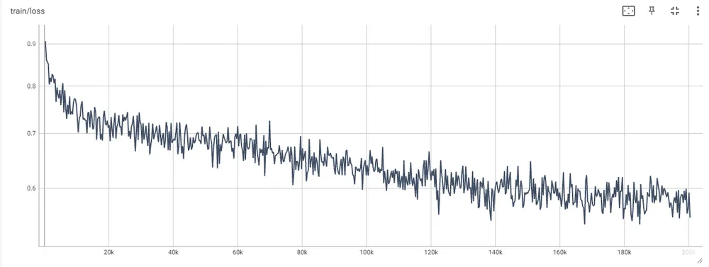
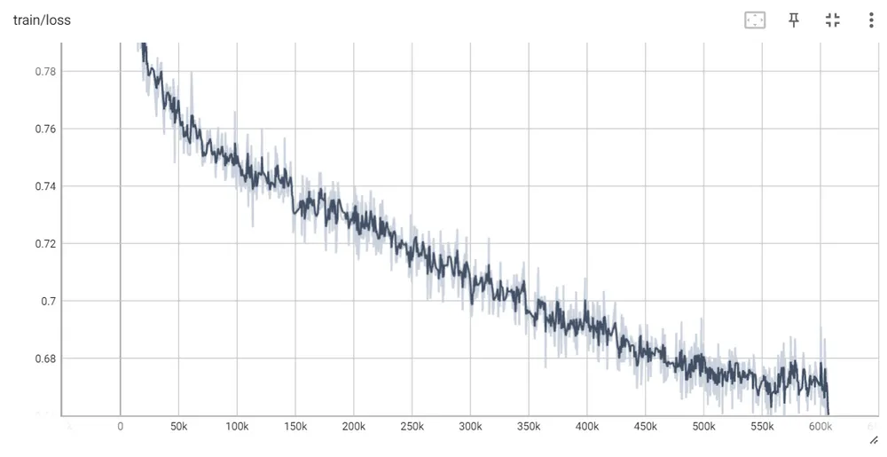
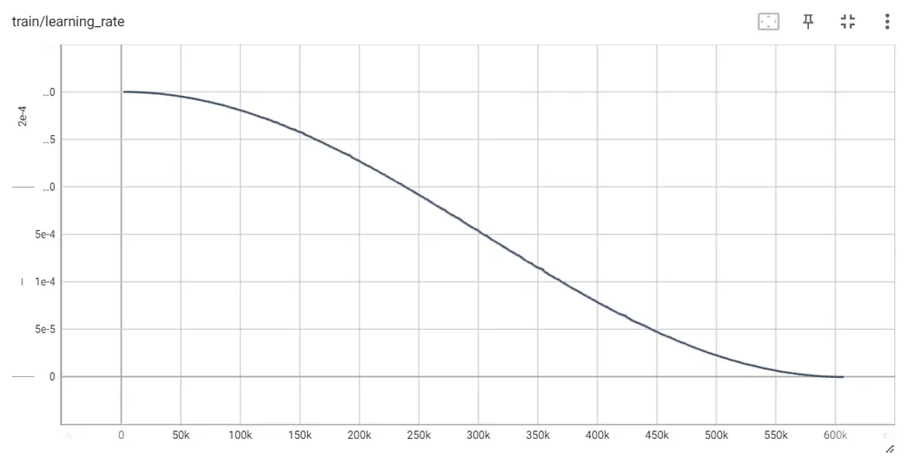
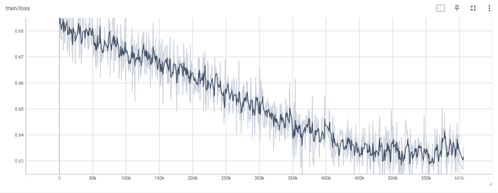

<p align="center" width="100%">

</p>

## Update Logs
- 2023.07.27: 장문 번역이 학습된 [🤗Gugugo-koen-1.3B-V1.0](https://huggingface.co/squarelike/Gugugo-koen-1.3B-V1.0)를 공개합니다.(QLoRA로 학습, 병합모델)
- 2023.07.27: [🤗sharegpt_deepl_ko_translation](https://huggingface.co/datasets/squarelike/sharegpt_deepl_ko_translation) 한-영 번역 데이터셋을 공개합니다.
- 2023.07.18: [🤗Gugugo-koen-1.3B-V0.95](https://huggingface.co/squarelike/Gugugo-koen-1.3B-V0.95)를 공개합니다.(QLoRA로 학습, 병합모델)
- 2023.07.13: [Gugugo-koen-1.3B-V0.9 학습 코드](https://github.com/jwj7140/Gugugo/blob/main/GugugoTrain.ipynb)를 공개합니다.
- 2023.07.13: Polyglot-ko 1.3B를 기반으로 [AIHUB](https://aihub.or.kr/) 970만 데이터가 학습된 [🤗Gugugo-koen-1.3B-V0.9](https://huggingface.co/squarelike/Gugugo-koen-1.3B-V0.9)를 공개합니다.(QLoRA로 학습, 병합모델)


# Gugugo: Korean translation model based on Polyglot-ko

[Polyglot-ko](https://huggingface.co/EleutherAI/polyglot-ko-1.3b)를 기반으로 만들어진 한국어 번역 모델입니다.

## Gugugo-koen-1.3B-V1.0

### 데이터셋

[sharegpt_deepl_ko_translation](https://huggingface.co/datasets/squarelike/sharegpt_deepl_ko_translation)

[sharegpt_deepl_ko](https://huggingface.co/datasets/junelee/sharegpt_deepl_ko)를 전처리하여 데이터셋을 제작하였습니다

### 프롬프트

- 한국어 -> 영어
```
### 영어: hello?</끝>
### 한국어:
```

- 영어 -> 한국어
```
### 한국어: 안녕하세요?</끝>
### 영어:
```

### 학습

Gugugo-koen-1.3B-V0.95를 기반으로 데이터셋을 학습시켰습니다

QLoRA를 사용해 RTX3060ti 8GB 1대로 학습을 진행했습니다.
- Epoch: 1
- learning-rate: 3e-4
- batch_size: 1
- Lora r: 8
- Lora target modules: query_key_value



### 출력 예시(비교)

```
### 영어: hello?</끝>
### 한국어: 안녕하세요?</끝>

### 한국어(V1): 안녕하세요?</끝>
```
```
### 영어: You’re misunderstanding right now. Hear me out.</끝>
### 한국어(v0.9): 지금 이해가 안 되는 거야. 내 말 들어.</끝>
### 한국어(v0.95): 지금 오해하신 거예요, 제 말 잘 들으세요.</끝>

### 한국어(V1): 지금 오해하고 계신 것 같습니다. 제 말을 들어보세요.</끝>
```
```
### 영어: All you need in this life is ignorance and confidence, then success is sure.</끝>
### 한국어(v0.9): 이 세상에는 당신이 알고 있는 것만으로는 부족하고, 자신감이 있어야 성공할 수 있다.</끝>
### 한국어(v0.95): 이 인생에서 필요한 것은 모두 무지와 자신감이며, 성공은 확실하다.</끝>

### 한국어(V1): 이 인생에서는 무지와 자신감만 있으면 성공은 확실합니다.</끝>
```
```
### 영어: If you are not willing to risk the usual, you will have to settle for the ordinary.</끝>
### 한국어(v0.9): 평소와 같은 위험을 감수하기 싫다면 평범한 것으로 타협해야 합니다.</끝>
### 한국어(v0.95): 평소에 위험을 감수하지 않으면 평범한 것으로 타협해야 합니다.</끝>

### 한국어(V1): 일반적인 것을 감수할 의향이 없다면 평범한 것을 선택해야 합니다.</끝>
```
```
### 영어: The Federal Aviation Administration has certified for testing a vehicle that a California startup describes as a flying car — the first fully electric vehicle that can both fly and travel on roads to receive US government approval.</끝>
### 한국어(v0.9): 연방항공청은 캘리포니아 스타트업이 미국 정부의 승인을 받기 위해 도로 위를 날아다니고 여행할 수 있는 첫 번째 완전 전기 자동차인 '날아다니는 자동차'로 묘사한 차량을 시험하도록 인증했다.</끝>
### 한국어(v0.95): 연방항공청은 캘리포니아 스타트업이 비행 자동차로 묘사한 차량을 미국 정부 승인을 받기 위해 도로에서 비행하고 여행할 수 있는 첫 번째 완전 전기 자동차로 인증했다.

### 한국어(V1): 연방 항공청은 캘리포니아 스타트업이 미국 정부 승인을 받기 위해 도로에서 비행하고 여행할 수 있는 첫 번째 완전 전기 자동차로 묘사되는 차량을 테스트하기 위해 인증을 받았습니다.</끝>
```
```
### 한국어: 한편 금융위원회와 금융감독원의 '6월 가계대출 동향'에 따르면 은행권과 제2금융권을 포함한 전 금융권 가계대출은 지난달 3조 5천억원 증가해 3개월 연속 증가세를 이어갔다.</끝>
### 영어(v0.9): Meanwhile, according to the Financial Services Commission and the Financial Servic..., the total number of household loans increased by 3.5 trillion won last month, including the banking sector and the secondary financial sector, according to the FSS and the Financial Service of Korea.</끝>
### 영어(v0.95): Meanwhile, according to the Financial Services Commission and the Financial Supervisory Service\'s "Monthly Household Loan Trends" in June, 3.5 trillion won in household loans including the banking sector and the second-largest financial sector increased the number of three months in a year.</끝>

### 영어(V1): On the other hand, according to the "June House Loan Trends" by the Financial Services Commission and the Financial Supervisory Service, all financial loans in the previous financial loans, including the banks and the secondary financial loans, increased by 3.5 trillion won last month, continuing their growth for the period of 3 months.</끝> 
```
```
### 한국어: 미국 경비 보안 업체 ADT에 따르면 남아프리카공화국은 안전 점수 10점 만점에 1점도 채 되지 않는 0.81점을 기록하며 세계에서 가장 위험한 휴양지 1위에 올랐다.</끝>
### 영어(v0.9): According to ADT, a US security security company, South Africa has recorded 0.81 points, as the world's most dangerous resort is ranked as the world's top 10.</끝>
### 영어(v0.95): According to ADT, a US security security company, South Africa ranked the world's most dangerous resort in 0.81 points, with only 1 point in the safety score of 10 points.</끝>

### 영어(V1): According to ADT, the United States Security Services Agency, South Africa has a 0.81 point lower than the safe score of 1 point, with less than 1 point in the world's most dangerous resorts.</끝>
```
```
### 한국어: 나는 무엇인지 그리워 이 많은 별빛이 내린 언덕 위에 내 이름자를 써 보고 흙으로 덮어 버리었습니다.</끝>
### 영어(v0.9): I wanted to remember what it was, and I wrote my name on the hill above the many stars.</끝>
### 영어(v0.95): I want to remember what it is, and I wrote my name on the hill above the many stars, and put it into soil.</끝>

### 영어(V1): I want to be what I am, I write my name on the hillside, writing it into the ground, covered with soil.</끝>
```
```
### 영어: New York. CNN. The Federal Aviation Administration has certified for testing a vehicle that a California startup describes as a flying car — the first fully electric vehicle that can both fly and travel on roads to receive US government approval. Alef Automotive said that its vehicle/aircraft, dubbed the “Model A,” is the first flying vehicle that is drivable on public roads and able to park like a normal car. It also has vertical takeoff and landing capabilities. It apparently will be able to carry one or two occupants and will have a road-range of 200 miles and a flying range of 110 miles. The company expects to sell the vehicle for $300,000 each with the first delivery by projected for the end of 2025. The FAA confirmed that it has issued the company a special airworthiness certificate, allowing for limited purposes that include exhibition, research and development. Numerous companies are working on all-electric VTOLs, which stands for vehicle takeoff and landing aircraft. The FAA said that Alef is “not the first aircraft of its kind” to get a special airworthiness certificate. However, Alef noted that its vehicle is different because of its ability to function both on roads and in the air, to appear like a normal car and to park in a normal parking space.</끝>
### 한국어(V1): 뉴욕 CNN. 연방 항공국은 캘리포니아 스타트업이 미국 정부의 승인을 받기 위해 도로를 주행하고 여행할 수 있는 첫 번째 전기 자동차인 \'비행 자동차\'로 묘사되는 차량을 테스트하기 위해 인증받았습니다. 알레프 오토모티브는 차량/항공기를 \'모델 A\'라고 부르며, 공공 도로에서 주행할 수 있고 일반 자동차처럼 주차할 수 있는 첫 번째 비행 자동차입니다. 또한 수직 이착륙 능력이 있습니다. 2025년 말까지 1대당 30만 달러에 판매할 수 있을 것으로 예상됩니다. 이 회사는 2025년 말까지 1대당 30만 달러에 차량을 판매할 수 있다고 예상합니다. 연방 항공국은 2025년 말까지 프로젝트를 통해 차량을 특별한 항공 안전 인증서를 발급할 것이라고 밝혔습니다. FAA는 이 회사가 차량이 이륙하고 착륙하는 데 필요한 특별한 안전 인증서를 발급했다고 확인했습니다. FAA는 Alef가 "이 기종의 첫 번째 항공"이라며 특별한 안전 인증서를 발급받을 자격이 있다고 밝혔습니다. 그러나 Alef는 차량이 도로와 공중에서 모두 작동하는 기능이 달라 일반 자동차처럼 보이고 일반 주차 공간에 주차할 수 있기 때문에 차량이 다르다고 언급했습니다.</끝>
```
```
### 영어: Repositories on the Hub are git version controlled, and users can download a single file or the whole repository. You can use the hf_hub_download() function to download files. This function will download and cache a file on your local disk. The next time you need that file, it will load from your cache, so you don’t need to re-download it. You will need the repository id and the filename of the file you want to download. For example, to download the Pegasus model configuration file:</끝>
### 한국어(V1): 허브의 리포지토리는 git 버전 컨트롤이며, 사용자가 하나의 파일 또는 전체 리포지토리를 다운로드할 수 있습니다. hf_hub_download() 함수를 사용하여 파일을 다운로드할 수 있습니다. 이 함수는 로컬 디스크에 파일을 다운로드하고 캐시에 저장합니다. 다음에는 해당 파일을 캐시에서 로드하여 캐시에서 다시 다운로드할 필요가 없습니다. 리포지토리 아이디와 다운로드할 파일의 파일 이름이 필요합니다. 예를 들어, Pegasus 모델 구성 파일을 다운로드하려면 다음과 같은 파일을 다운로드해야 합니다.</끝>
```
```
### 영어: Once when I was six years old I saw a magnificent picture in a book, called True Stories from Nature, about the primeval forest. It was a picture of a boa constrictor in the act of swallowing an animal. Here is a copy of the drawing. In the book it said: 'Boa constrictors swallow their prey whole, withoutchewing it. After that they are not able to move, and they sleep through the six months that they need for digestion.' I pondered deeply, then, over the adventures of the jungle. And after some work with a colored pencil I succeeded in making my first drawing. My Drawing Number One. It looked something like this: I showed my masterpiece to the grown-ups, and asked them whether the drawing frightened them. But they answered: 'Frighten? Why should any one be frightened by a hat?' My drawing was not a picture of a hat. It was a picture of a boa constrictor digesting an elephant. But since the grown-ups were not able to understand it, I made another drawing: I drew the inside of a boa constrictor, so that the grown-ups could see it clearly. They always need to have things explained. My Drawing Number Two looked like this:</끝>
### 한국어(V1): 6살 때 나는 자연의 진실이라는 책에서 원시림에 대한 이야기를 읽었습니다. 동물을 삼켜 삼키는 부아 콘스트릭의 그림이었습니다. 이 그림은 동물을 삼키는 보아 콘스트릭의 사진이었습니다. 다음은 그림의 사본입니다. 책에서는 이렇게 말했습니다: '부아 콘스트릭은 동물을 삼키지 않고 통째로 삼켜 먹는다. 그 후에는 소화를 위해 필요한 6개월 동안 잠을 잔다'고 말했습니다. 저는 깊은 생각에 잠겨 정글의 모험에 대해 생각했습니다. 그리고 색연필로 그림을 그리는 데 성공했습니다. 제 그림 번호 1번입니다. 다음과 같은 것 같았습니다: 저는 어른들에게 걸작을 보여주고, 그들에게 그림이 무서웠는지 물어봤습니다. 하지만 그들은 대답했습니다: '겁이 나요? 왜 모자가 무서워요?' 제 그림은 모자가 그려진 그림이 아니었습니다. 그것은 코끼리를 삼킨 보아 콘스트릭의 그림이었습니다. 하지만 어른들은 그것을 이해하지 못했기 때문에 다른 그림을 그렸습니다: 보아 콘스트릭의 내부를 그렸는데, 어른들이 그것을 분명히 볼 수 있도록 그렸습니다. 하지만 어른들은 그것을 이해하지 못했기 때문에 다른 그림을 그렸습니다: 보아 콘스트릭의 내부를 그렸는데, 어른들이 그것을 분명히 볼 수 있도록 그렸습니다. 항상 설명이 필요합니다. 제 그림 두 번째는 다음과 같았습니다:</끝>
```

## Gugugo-koen-1.3B-V0.9 ~ V0.95

### 데이터셋

[AIHUB "기술과학 분야 한-영 번역 병렬 말뭉치 데이터"](https://aihub.or.kr/aihubdata/data/view.do?dataSetSn=71266)

[AIHUB "일상생활 및 구어체 한-영 번역 병렬 말뭉치 데이터"](https://aihub.or.kr/aihubdata/data/view.do?dataSetSn=71265)

[AIHUB "전문분야 영-한·중-한 번역 말뭉치 (식품)"](https://aihub.or.kr/aihubdata/data/view.do?dataSetSn=71262)

[AIHUB "한국어-영어 번역 말뭉치(기술과학)"](https://aihub.or.kr/aihubdata/data/view.do?dataSetSn=124)

[AIHUB "한국어-영어 번역 말뭉치(사회과학)"](https://aihub.or.kr/aihubdata/data/view.do?dataSetSn=125)

[AIHUB "한국어-영어 번역(병렬) 말뭉치"](https://aihub.or.kr/aihubdata/data/view.do?dataSetSn=126)


한국어-영어 전체 약 970만 문장의 데이터를 사용했습니다.

### 학습

#### V0.9

QLoRA를 사용해 RTX4090 24GB 1대로 학습을 진행했습니다.
- Epoch: 1
- learning-rate: 3e-4
- batch_size: 16
- Lora r: 8
- Lora target modules: query_key_value




#### V0.95

Gugugo-koen-1.3B-V0.9를 기반으로 같은 데이터셋을 1Epoch 더 학습시켰습니다.

QLoRA를 사용해 RTX4090 24GB 1대로 학습을 진행했습니다.
- Epoch: 1
- learning-rate: 3e-4
- batch_size: 16
- Lora r: 8
- Lora target modules: query_key_value



## 한계점

Polyglot-ko를 기반으로 하기 때문에 영어->한글 번역에서 더 성능이 좋습니다.

데이터셋에서 구어체의 비중이 적기 때문에 구어체 번역에서 낮은 성능을 보입니다.

## TO DO LIST

- 관용어 및 비속어 추가 학습 진행
- RLHF 강화학습 진행
